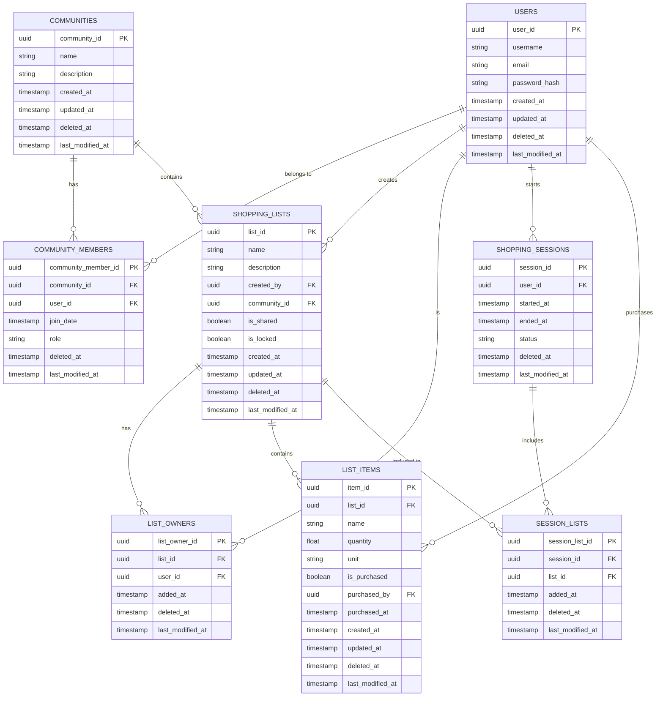
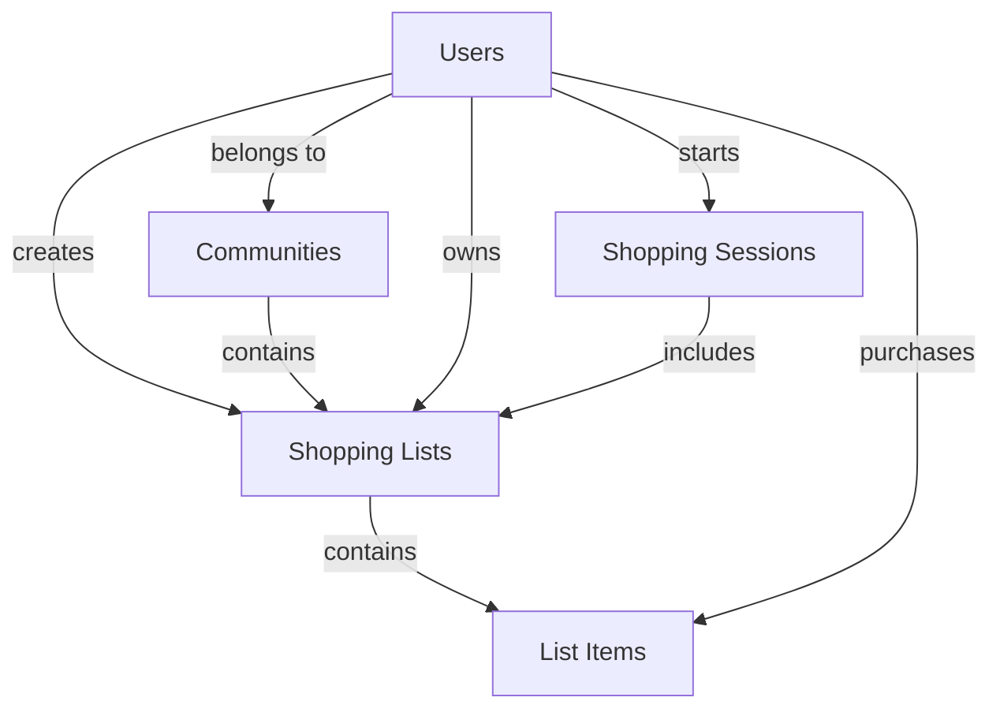

# Shopping App Data Model

This document outlines the relational data model for the Shopping Companion App. The current implementation uses a "last edit wins" approach for simplicity, but the model is designed to be compatible with more sophisticated conflict resolution strategies in the future.

## Core Design Principles

- **Soft Delete**: All tables include a `deleted_at` timestamp field to support soft deletion
- **Audit Fields**: Basic tracking of creation and modification timestamps
- **Future-Compatible**: Structure allows for future enhancement with version control and conflict resolution

## Entity Relationship Diagram



## Table Definitions

### Users Table
```
users
- user_id (PK, UUID)
- username (string)
- email (string)
- password_hash (string)
- created_at (timestamp)
- updated_at (timestamp)
- deleted_at (nullable timestamp)
- last_modified_at (timestamp)
```

### Communities Table
```
communities
- community_id (PK, UUID)
- name (string)
- description (string)
- created_at (timestamp)
- updated_at (timestamp)
- deleted_at (nullable timestamp)
- last_modified_at (timestamp)
```

### Community_Members Table
```
community_members
- community_member_id (PK, UUID)
- community_id (FK -> communities.community_id)
- user_id (FK -> users.user_id)
- join_date (timestamp)
- role (string: 'admin', 'member')
- deleted_at (nullable timestamp)
- last_modified_at (timestamp)
```

### Shopping_Lists Table
```
shopping_lists
- list_id (PK, UUID)
- name (string)
- description (string)
- created_by (FK -> users.user_id)
- community_id (FK -> communities.community_id, nullable)
- is_shared (boolean)
- is_locked (boolean)
- created_at (timestamp)
- updated_at (timestamp)
- deleted_at (nullable timestamp)
- last_modified_at (timestamp)
```

### List_Owners Table
```
list_owners
- list_owner_id (PK, UUID)
- list_id (FK -> shopping_lists.list_id)
- user_id (FK -> users.user_id)
- added_at (timestamp)
- deleted_at (nullable timestamp)
- last_modified_at (timestamp)
```

### List_Items Table
```
list_items
- item_id (PK, UUID)
- list_id (FK -> shopping_lists.list_id)
- name (string)
- quantity (float)
- unit (string, e.g., 'kg', 'pieces')
- is_purchased (boolean)
- purchased_by (FK -> users.user_id, nullable)
- purchased_at (timestamp, nullable)
- created_at (timestamp)
- updated_at (timestamp)
- deleted_at (nullable timestamp)
- last_modified_at (timestamp)
```

### Shopping_Sessions Table
```
shopping_sessions
- session_id (PK, UUID)
- user_id (FK -> users.user_id)
- started_at (timestamp)
- ended_at (nullable timestamp)
- status (string: 'active', 'completed', 'cancelled')
- deleted_at (nullable timestamp)
- last_modified_at (timestamp)
```

### Session_Lists Table
```
session_lists
- session_list_id (PK, UUID)
- session_id (FK -> shopping_sessions.session_id)
- list_id (FK -> shopping_lists.list_id)
- added_at (timestamp)
- deleted_at (nullable timestamp)
- last_modified_at (timestamp)
```

## Key Relationships



## Shopping Session Management

The Shopping Sessions and Session Lists tables play crucial roles in the application's core functionality:

### Purpose of Shopping_Sessions Table

The Shopping_Sessions table tracks active shopping activities and serves several important functions:

1. **Shopping State Management**: 
   - Records when a user begins shopping (`started_at`)
   - Tracks when shopping is completed (`ended_at`)
   - Maintains the current status of shopping activities (`status`)

2. **List Locking Mechanism**:
   - When a shopping session is active, associated lists are locked
   - Prevents concurrent edits to lists that are actively being shopped
   - Ensures data consistency during the shopping process

3. **User Activity Tracking**:
   - Links shopping activities to specific users (`user_id`)
   - Enables history and analytics of shopping patterns
   - Provides accountability for purchased items

### Purpose of Session_Lists Table

The Session_Lists table is a junction table that connects shopping sessions to multiple shopping lists:

1. **Multi-List Shopping Support**:
   - Allows one shopping session to include multiple lists
   - Enables a shopper to collect items for multiple people/purposes in one trip
   - Maintains the relationship between purchased items and their source lists

2. **Checkout Organization**:
   - Facilitates the checkout feature where items are grouped by source list
   - Enables easy sorting of purchased items into separate bags per list
   - Preserves the origin of each item for proper distribution after shopping

3. **List Selection Tracking**:
   - Records which lists were selected for a particular shopping trip
   - Maintains timestamps of when lists were added to a session
   - Supports historical analysis of shopping patterns

### Shopping Flow Implementation

These tables enable the following workflow:

1. User enters shopping mode and selects lists to shop from
2. System creates a Shopping_Session record with `status = 'active'`
3. System creates Session_Lists records for each selected list
4. System locks all selected lists (`is_locked = true` in Shopping_Lists)
5. During shopping, items are marked as purchased and linked to the shopper
6. At checkout, items are grouped by their source list using the Session_Lists relationships
7. When shopping ends, the session is marked as completed and list locks are released
8. Unpurchased items can be moved to a new list for future shopping

## Future Conflict Resolution Enhancement

To enhance this model for robust conflict resolution in the future, consider adding:

1. **Version Control**:
   - Add `version` integer field to tables requiring conflict resolution
   - Increment version on each update

2. **Change Tracking**:
   - Implement a change log table to track modifications
   - Store both client and server timestamps

3. **Conflict Detection**:
   - Compare versions during updates
   - Implement optimistic concurrency control

4. **Resolution Strategies**:
   - Define rules for automatic conflict resolution
   - Create UI for manual conflict resolution when needed

The current "last edit wins" approach will use the `last_modified_at` timestamp to determine which edit takes precedence when conflicts occur.
