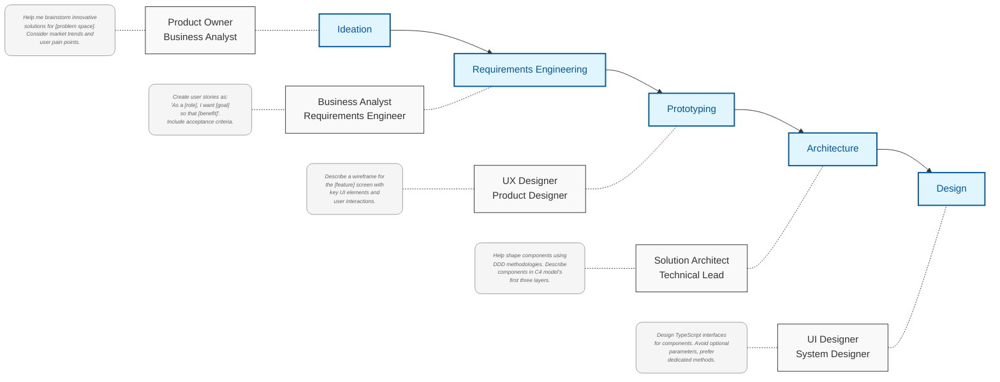
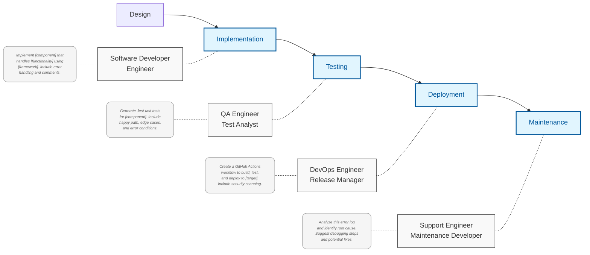

---
# You can also start simply with 'default'
theme: default
background: https://wallpaperaccess.com/full/4954296.jpg
# some information about your slides (markdown enabled)
title: Prompt Driven Development
info: |
  An overview of what's going on out there
# apply unocss classes to the current slide
class: text-center
# https://sli.dev/features/drawing
drawings:
  persist: false
# slide transition: https://sli.dev/guide/animations.html#slide-transitions
transition: slide-left
# enable MDC Syntax: https://sli.dev/features/mdc
mdc: true
---

---

<style>

/* global styles */
.slidev-layout.quote p:first-of-type {
  font-style: italic;
  font-size: 3rem;
  line-height: 5rem;
  text-align: center;

  &::before, &::after {
    content: '"';
  } 
}

.slidev-vclick-current {
  font-weight: 600;
}

.slidev-layout ul:not(.markdown-visualizer .rendered ul):not(.prompt-example-container ul) {
  padding-top: 2rem;
  list-style: none;
  
  & li {
  font-size: 1.5rem;
  padding-bottom: 1.5rem
  }
}

h3 {
  font-style: italic;
}

</style>

# Prompt Driven Development

A quick glance at how producing software
<span v-mark="{type: 'strike-through', iterations: 4, strokeWidth: 4, color: 'red'}">has changed</span><v-click at=1> has been changing recently and keeps on speeding up.</v-click>

<v-switch>
  <template #1>
  
  <p>AI assisted coding</p>
  </template>
  <template #2>
  
  <p>AI as pair programmer</p>
  </template>
  <template #3>
  
  <p>Agentic vibe coding</p>
  </template>
</v-switch>

<!--
We don't know what's coming, but we know – like the SpiceGirls sing – things (aka "software development") will never be the same again
-->


---
layout: quote
---

<style scoped>
  h2 {display: none}
</style>

## Vibe coding - quote 1

It's not really coding - I just see things, **say things, run things, and copy-paste** things, and it **mostly** works.

Andrej Karpathy, OpenAI Co-founder 

---
layout: quote
---

<style scoped>
  h2 {display: none}
</style>

## Vibe coding - quote 2

AI-assisted coding (including vibe coding, where you might **barely look at the code**) gets you **speed**!

Andrew NG, Founder of DeepLearning.AI

---
layout: quote
---

<style scoped>
  h2 {display: none}
</style>

## Vibe coding - quote 3

Prompt-Driven-Development, where you produce code with natual language is a lot of fun – until you have to **debug** and **understand** what AI agents did in the meantime. And they are fast!

Oliver Jägle, Software-developer

---

## bolt.new – an OG of agentic software development

<PromptInteraction
  prompt="Build a mobile app that I can use with my wife to do the weekly shopping."
  response="Based on your requirements, I'll create a beautifully designed shopping app for you and your wife to manage your weekly shopping together. The app will focus on collaboration, ease of use, and visual appeal with an Apple-inspired aesthetic."
  aiLabel="bolt.new"
  additionalContent=""
  additionalContentPosition="right"
  additionalContentWidth="20%"
/>

<!--
[project](https://bolt.new/~/sb1-curscjb9)
-->

---
layout: full
---

### Hip-Shot-Development


<!--

It's crazy: How can such a lot of stuff have been done in such a short amount of time?

It looks impressive at first, but there's a lot of features in there we didn't ask for. Or we wanted to pick other tools.

Let's try to slow things down a bit and start with the requirements

-->

---

### Workaholic AI

<PromptInteraction
fontSize="0.8em"
prompt="I want to build an app for shopping groceries. Before we start with the actual application, I want you to help he shape the requirements in a project design document (PDD)"
thoughts="<li>The user wants to build a grocery shopping app and is asking for help with creating a Project Design Document (PDD) first. They've provided specific guidelines for how I should respond, emphasizing beautiful design, readability, and proper organization.</p
<li>I need to create a comprehensive PDD for a grocery shopping app. I'll focus on creating:</li>
<ol>
<li>An approach statement</li>
<li>Core features (4-8 bullet points)</li>
<li>Design elements (bullet points)</li>
</ol>
<li>For a grocery shopping app, I'll need to consider features like:</li>
<ul>
<li>Product browsing and searching</li>
<li>Shopping cart functionality</li>
<li>User accounts</li>
<li>Order history</li>
<li>Payment processing</li>
<li>Delivery options</li>
<li>Product categories</li>
<li>Favorites/saved items</li>
</ul>
<li>For the design, I'll focus on:</li>
<ul>
<li>Modern, clean interface</li>
<li>Appropriate color scheme</li>
<li>Typography</li>
<li>Responsive design</li>
<li>Navigation patterns</li>
<li>Visual hierarchy</li>
</ul>
<li>Let me craft a response following the required format.</li>"
  response="<li>Based on your requirements, I'll help you create a comprehensive Project Design Document (PDD) for a grocery shopping application. We'll focus on creating a beautifully designed, user-friendly experience that combines functionality with Apple-level aesthetics while ensuring it serves the core needs of grocery shoppers.</li>
<li><strong>Core Features</strong>:</li>
<ul>
<li>Intuitive product browsing with categorization (produce, dairy, meat, etc.)</li>
<li>Smart search functionality with filters and suggestions</li>
<li>Shopping list creation and management</li>
<li>Shopping cart with easy add/remove functionality</li>
<li>Order history and one-click reordering</li>
<li>Personalized recommendations based on purchase history</li>
<li>Delivery scheduling with time slot selection</li>
<li>Seamless checkout process with multiple payment options</li>
</ul>
<li><strong>Design Elements</strong>:</li>
<ul>
<li>Clean, minimalist interface with ample white space and a focus on product imagery</li>
<li>Color system featuring fresh green primary (#34D399), complementary blue (#60A5FA), accent orange (#FB923C), with success, warning, and error states</li>
<li>Subtle animations for cart additions, transitions between screens, and loading states</li>
<li>Typography using a modern sans-serif font family with varying weights for hierarchy</li>
<li>Card-based product displays with high-quality imagery and clear pricing</li>
<li>Bottom navigation on mobile, expanding to side navigation on larger screens</li>
<li>Micro-interactions that provide feedback for user actions (adding items, completing checkout)</li>"
  aiLabel="bolt.new"
/>

<!--
[project](https://bolt.new/~/sb1-21tkywal)

Now, it's only creating documentation, but it's still over-achieving:

-->

---

### AI business engineer – still workaholic

<MarkdownVisualizer
  file="/grocery-app-pdd-bolt.md"
  height="400px"
  sourceTitle="pdd.md"
  renderedTitle="Preview"
  sourceFontSize="0.75em"
  fontSize="0.75em"
  lineHeight="1.2"
/>

<!--
Now, we can at least influence what the AI will try to achieve. 
The documentation created will be usable as context for the subsequent requests.
-->

---

### We didn't ask for user flows

<MarkdownVisualizer
  file="/grocery-app-user-flows-bolt.md"
  height="400px"
  sourceTitle="user-flows.md"
  renderedTitle="Preview"
  sourceFontSize="0.75em"
  fontSize="0.75em"
  lineHeight="1.2"
/>

---

### We didn't ask for wireframes

<MarkdownVisualizer
  file="/grocery-app-wireframes-bolt.md"
  height="400px"
  sourceTitle="wireframes.md"
  renderedTitle="Preview"
  sourceFontSize="0.75em"
  fontSize="0.75em"
  lineHeight="1.2"
/>

---

### We didn't ask for technical architecture

<MarkdownVisualizer
  file="/grocery-app-ta-bolt.md"
  height="400px"
  sourceTitle="technical-architecture.md"
  renderedTitle="Preview"
  sourceFontSize="0.75em"
  fontSize="0.75em"
  lineHeight="1.2"
/>

---

<style scoped>
p {font-size: 2rem};
</style>

... but it 💯 makes sense to think about it!

<ul>
<v-clicks>
<li>
It's magic 🪄
</li>
<li>
It's AI 🤖
</li>
<li>
It's agentic 🦾🛠ï¸
</li>
</v-clicks>
</ul>

<!--

So let's see whether we can tame it.

-->

---
layout: quote
---

The future of software development is about **setting the proper boundaries** for agentic systems

A desparate software developer after debugging and reading what bolt.new generated code for an hour

---

## How can we as software developers set boundaries?

<ul>
<v-clicks>
<li>Be aware of the agents in our development environment &nbsp; 🤖🤖🤖
</li>
<li>System Prompt</li>
<li>Project Prompt</li>
<li>User Prompt</li>
<li>Context</li>
</v-clicks>
</ul>

---
layout: section
---

## Step-by-step

A small guidance for 
<span v-mark="{type: 'strike-through', iterations: 2, strokeWidth: 10, color: 'red', at: 1}">old</span> software developers

<!--

This is all not rocket science and there are different "methodologies" for prompt-engineering.

I just share with you what works for me and what I found useful, being a software engineer who wants to remain a software engineer for the next years to come.

-->

---
layout: two-cols
---

### Know your agents

{width=400px lazy}

<template #right>

{width=400px lazy}

</template>

<!--

Obviously, there are agents with proprietary tools in all the development environments. But what can they do?

-->

---

### It's a black box

<svg width="400" height="400" viewBox="0 0 400 400" xmlns="http://www.w3.org/2000/svg">
  <rect x="25" y="25" width="400" height="400" fill="black" />
</svg>

<!--

IDE providers constantly evolve the agents they use as well as the tools they are given.

Those providers determine usage of languages, frameworks, SaaS-offering, ...

Unless you use an open source prompt driven development tool like [bolt.diy](bolt.diy) or – shameless plug – [my very own piddie, WIP](https://github.com/mrsimpson/piddie), you are not going to understand why things happen – or how to optimize for them.

-->

---

### System prompt

- **Implicitly** included in each interaction
- Not always modifyable
- Should contain only very **generic instructions (that always apply)**

<MarkdownVisualizer
  file="/sample-system-prompt.md"
  height="150px"
  sourceTitle="sample-system-prompt.md"
  renderedTitle="Preview"
  sourceFontSize="0.75em"
  fontSize="0.75em"
  lineHeight="1.2"
/>

<!--

Even if the application allows us to define the system prompt, when using closed source software, we can never be sure that there's no additional content being added to it.

-->

---

### Project prompt

- **Explictly** included in each interaction
- Part of your software **repository**
- your project: **rules, conventions, structure**

<MarkdownVisualizer
  file="/sample-project-prompt.md"
  height="150px"
  sourceTitle="sample-project-prompt.md"
  renderedTitle="Preview"
  sourceFontSize="0.75em"
  fontSize="0.75em"
  lineHeight="1.2"
/>

<!--

Not sure how to best compose those files? Ask your LLM to help you: 

"Ask me what you need to know in order to provide a good system prompt to an LLM for a software development project"

-->

---

### User prompt

- Instructs the agents **what to achieve**
- Prefer **exploration** over imperative programming
- Address it **like an experienced collegue** who's from another project:
  - Start with the current sitution
  - Describe the target you want to achieve
  - Let him know what you already know (no guesses!)
 
**Avoid un-intentional priming!**

<!--

Guessing will prime the LLM. 

Due to the inference nature of LLMs, they will always start with your assumptions. 

They act like an amplifier.

-->

---

### Context!

- Context is **crucial** to the quality of the result
- There's no schematic difference between prompts and context content
- Send **relevant** information
- Persist context as **documentation**!

=> So let's create context. But where to start?

<!--

It's finally the age of the "information developer" – or team up with the LLM to take on multiple roles.

- Business Engineer
- Architect
- Softare developer
- ...

-->

---

### Explore!

<PromptInteraction
  prompt="I want to develop an mobile application which can be used by multiple persons to go shopping.
Before we start developing it, I want you to help me shape the minimal requirements.
Ask me what you need to know in order to create a basic pdd."
  response="I'd be happy to help you shape the minimal requirements for your multi-user shopping mobile application. To create a basic Product Design Document (PDD), I need to understand several key aspects of your vision. Let me ask
you some essential questions:
<br/>
1. Core Purpose: What's the primary problem your shopping app is trying to solve? Is it for shared grocery lists, splitting costs, coordinating purchases, or something else?
<br/>
2. Target Users: Who will be using this app? Is it for families, roommates, friends, or another specific group?
<br/>
3. Key Features: What are the must-have features for your minimum viable product (MVP)? For example:<br/>
   • Shared shopping lists?<br/>
   • Real-time updates?<br/>
   • User roles/permissions?<br/>
   • Cost tracking/splitting?<br/>
<br/>
4. Platform Requirements: Are you targeting iOS, Android, or both? Any specific device compatibility needs?
<br/>
5. User Flow: How do you envision users interacting with the app? For example, creating lists, inviting others, marking items as purchased, etc.
<br/>
6. Data Management: What kind of data will need to be stored? Will users need accounts? How will data be shared between users?
<br/>
7. Monetization: Do you have plans for monetizing the app (free, subscription, ads, etc.)?
<br/>
8. Technical Constraints: Any specific technical requirements or limitations I should be aware of?
<br/>
9. Timeline: What's your expected timeline for development?
<br/>
10. Success Metrics: How will you measure if the app is successful?
<br/>
Once I have your responses to these questions, I can help draft a focused PDD that outlines the minimal requirements for your shopping application."
/>

<!--

Apply "inversion of control".

This will turn it into a rubber-ducking session which will help you shape your thoughts!

-->

---

### Be explicit

<PromptInteraction
  fontSize="0.7rem"
  userLabel="A rubber-ducker"
  prompt="It is meant for groceries. Major objective is that only one person has to go shopping and while doing it can grab items that other persons he elaready knows (friends, family, community) in order to bring it along.
**Major features:**
-  multiple persons can edit the same shopping list if both are owners of the list.
- people of the same community can share their own lists with the group. then, the list becomes visible to the community. While shopping, the shopper can select shared shopping lists for items to bring along. During shopping, these items are merged into one list
- when going to the checkout desk, the application shall group the shopped items per source shopping list so that the shopper can easily pack them in separate bags.
Tracking prices and splitting totals is not in scope. It's only about quantities
In order to fulfill these capabilities, we need
- Shared shopping lists
- real time reactive updates
- basic roles and permissions (communities, list owners, shares)
- being able to share a list
CRUD interactions for the list and items are necessary. Additional actions: select bring-along-lists, go shopping, mark items purchased, checkout, end shopping (ending a shopping will move all non-purchased items to a new list).
**Let's not get into the details of the technical implementation**. Let me know if there are aspects you don't fully understand or which you'd like to elaborate more."
/>

<!--

It's not that we're not developing, it's the very opposite! We're just not coding, but we shape our software-to-be.

[The commit with the Amazon Q based PDD](https://github.com/mrsimpson/prompt-driven-collaborative-shopping/commit/bff5f99f6841002bf4cbdb0b7f12fbecadbc8286)

-->

---

### Move on **only** once you're ready

<PromptInteraction
  userLabel="A satisfied business engineers"
  prompt="Let's move on to the data model. I prefer a relational model"
  response="<p>I&#39;ll help you create a relational data model for your shopping app. Based on the requirements in your PDD, here&#39;s how we could structure the database..."
/>

<!--

Most important: **Read**! Iteratively adapt. 

Check the final version and move on to the next stage of the SLDC only once you're really confident.

-->

---

### Read(!), discuss ideas, define out of scope

<PromptInteraction
  userLabel="A critical architect"
  prompt="ok, let's **not** support conflict resolution now (last edit wins is ok for now), but make the rest of the data model compatible for later enhancement. Document the data model in a file. 
  Add mermaid based diagrams"
/>

{width=400px lazy}

<!--

We all like beautiful diagrams, don't we? 

They don't only look appealing, they will help us understand what the AI will get to know later. 

If we don't do this, it's all a matter of machine-heuristics.

[The commit of the data model, written by Amazon Q](https://github.com/mrsimpson/prompt-driven-collaborative-shopping/commit/6004e8268cba4760c1e9f1c4d9d17e0386c713bf)

-->

---

### Pinpoint achievements

<PromptInteraction
  userLabel="A critical architect"
  prompt="
ok, now that we've got all this sketched, I want you to create a comprehensive architecture documentation for developers. I already added an arc42.md file. Fill in all the aspects we already discussed and link to the pdd and the data model for details."
/>

<!--

There are established formats that are easier to consume for you as an experienced developer. Make the AI use them!

Provide a template, which often includes comments how to use it.

Make sure you're still in the context of your session (!), then ask the LLM to pin down what it understood so far.

[The commit with the ARC42 documentation, written by Amazon Q](https://github.com/mrsimpson/prompt-driven-collaborative-shopping/commit/0ca78fb2aa1945dcad8aa5d918cdf1fadb3580d1)

-->

---

### Document as-if

<PromptInteraction
  userLabel="Software developer"
  prompt="ok, now let's create a comprehensive README wich gives a high level overview of the project.
  We'll be implementing the app as a react native app.
  Describe it in the readme **as if it had already been built using react native, expo**. Unit testing with jest. Also describe how to set up supabase and get started locally" />

<!--

Sometimes, we want to test out variations (e. g. of frameworks which we use). We just want to see how this would integrate.

With LLMs, we can easily simulate options!

-->

---

### Be critical and precise

 <PromptInteraction
  userLabel="Software developer"
  prompt="the part about supabase is not correct; the policies and so on will be part of the migrations. also, we don't need a supabase account, but can use the supabase cli to develop locally: https://supabase.com/docs/guides/local-development/cli/getting-started" 
  response="You're absolutely right about the Supabase setup. Let me correct the README to reflect the use of Supabase CLI for local development instead of requiring a Supabase account, and to clarify that policies will be part of migrations." />

<!--

Avoid confirmation-click-raids. If there's only a small aspect you don't agree with, change it.

Or – most of the times better – ask the LLM what the purpose of something you disagree with is.
This will prevent priming!

-->

---

### Prepare the next steps

  <PromptInteraction
  userLabel="Software developer"
  maxHeight="100px"
  prompt="ok, finally describe that all backend logic which is responsible for consistency resides within supbase. simple functions as plsql database functions, complex functions as deno functions" 
  response="You're right to emphasize that backend logic for data consistency should reside within Supabase. [...]
  <br />
    1. PL/pgSQL Database Functions for simpler operations:
      • ...
  <br />
    2. Deno Edge Functions for more complex operations:
      • ...
  <br />
Would you like me to add this information to one of the documentation files we've created, such as the architecture document or README?"
/>

<PromptInteraction
  userLabel="Software developer"
  prompt="add this to both, the readme (with the description in which folder they live) and to the arc42 (high level)"
  />

---

### Feed the context, keep the knowledge

<style scoped>
.slidev-code-wrapper {
  max-height: 300px;
  overflow-y: auto;
}

.slidev-code-wrapper pre {
  max-height: 100%;
  overflow-y: auto;
}
</style>

```bash
# for Amazon Q cli
/context add docs/*.md
/context add README.md

# 
/compact
```

```markdown
â•â•â•â•â•â•â•â•â•â•â•â•â•â•â•â•â•â•â•â•â•â•â•â•â•â•â•â•â•â•â•â•â•â•â•â•â•â•â•â•â•â•â•â•â•â•â•â•â•â•â•â•â•â•â•â•â•â•â•â•â•â•â•â•â•â•â•â•â•â•â•â•â•â•â•â•â•â•â•â•
                       CONVERSATION SUMMARY
â•â•â•â•â•â•â•â•â•â•â•â•â•â•â•â•â•â•â•â•â•â•â•â•â•â•â•â•â•â•â•â•â•â•â•â•â•â•â•â•â•â•â•â•â•â•â•â•â•â•â•â•â•â•â•â•â•â•â•â•â•â•â•â•â•â•â•â•â•â•â•â•â•â•â•â•â•â•â•â•

## CONVERSATION SUMMARY

* **Shopping App Concept**: Developed requirements for a collaborative grocery shopping mobile application
* **Core Features**: Multiple users can edit shopping lists, share lists with communities, merge lists while shopping, and group items by source list at checkout
* **Data Model**: Created a relational database model with soft-delete functionality
* **Backend Architecture**: Decided to use Supabase for backend with server-side consistency logic
* **Documentation**: Created comprehensive documentation including PDD, data model, and architecture documentation

## TOOLS EXECUTED

* **fs_write**: Created ShoppingApp_PDD.md with product design document
* **fs_write**: Created ShoppingApp_DataModel.md with relational data model and entity relationships
* **fs_write**: Created arc42.md with comprehensive architecture documentation
* **fs_write**: Created README.md with project overview and setup instructions
* **fs_read**: Read existing documentation files to update them

## TECHNICAL INFORMATION

* **Data Model Components**:
  * Users, Communities, Community_Members tables
  * Shopping_Lists, List_Owners, List_Items tables
  * Shopping_Sessions, Session_Lists tables
  * All tables include soft-delete functionality and audit fields

* **Backend Implementation**:
  * PL/pgSQL Database Functions for simple operations (timestamps, soft delete, list locking)
  * Deno Edge Functions for complex operations (shopping sessions, multi-table operations)
  * Row-Level Security (RLS) policies for access control

* **Frontend Stack**:
  * React Native with Expo
  * Dexie.js for local-first storage
  * Lazy synchronization with Supabase

## KEY INSIGHTS

* Shopping sessions and session lists tables are crucial for tracking active shopping and enabling checkout organization
* Soft-delete approach preserves data integrity while allowing for apparent deletion
* Local-first architecture with Dexie.js enables offline functionality
* "Last edit wins" conflict resolution is sufficient for initial implementation
* Server-side business logic ensures data consistency across clients
* Supabase CLI enables local development without requiring a Supabase account

The conversation history has been replaced with this summary.
It contains all important details from previous interactions.
```

<!---

Sometimes, you're reaching a point where you start a new chapter. 

Then, compacting the context and continuing with your explicitly created context documents helps!

-->

---
layout: full
---

## Good vides – the responsible way


---

## Not sure where to start?

Create an implementation plan

<PromptInteraction
  fontSize="0.7rem"
  prompt="I already scaffolded an expo-project-template.
Before we start, I want you to create an implementation plan which allows us to continuously check that we're still on track.
- Please create an implementation plan with goals and sub-goals we can tick as we implement them
- At the beginning, leave out technical complexity which can be added lateron (such as row-level-security-policies)
- Between the database / supabase layer and the frontent, plan to create interfaces that are business-oriented and allow swapping out the database.
- Start without the backend and go local-first
"
response="I'll create an implementation plan for your collaborative shopping app that follows a local-first approach and allows for incremental development. Let's organize this with clear goals and sub-goals that we can track as we progress.
<br/>
[...]
<br/>
This approach will allow us to have a working application from the beginning while incrementally adding backend capabilities.
"
/>

<!--

Once we're ready, we can move on to the fun part – but don't get too excited with too huge steps!

-->

---

<MarkdownVisualizer
  file="/grocery-app-implementation-plan.md"
  height="400px"
  sourceTitle="implementation-plan.md"
  renderedTitle="Preview"
  sourceFontSize="0.75em"
  fontSize="0.75em"
  lineHeight="1"
  :showSource=false
/>

<!--

[start vibing in bolt.new](https://bolt.new/github.com/mrsimpson/prompt-driven-collaborative-shopping/)

– or do it like a professional software-developer might do it

-->

---

### Jack-of-all-trades – 10x your ... role



---

### Jack-of-all-trades – 10x your ... role II



---
layout: end
---
Have fun!

---
layout: section
---

Appendix

Other tips

---

### Resume

<PromptInteraction
  prompt="I want to continue the development of this app.
Make yourself familiar with the pdd and the implementation plan, then propose next steps"
  response="I've reviewed the project documentation and understand that you're working on a collaborative shopping application that allows users to create, share, and shop from multiple lists. Let me summarize what I've learned and
propose next steps."
/>

---

### Local first simplifies!

<PromptInteraction
  prompt="> yes, continue. Please note that when going local first, we do not have a profile (which will come from supabase lateron). Instead of protecting the routes, I want you to make the router validate whether the user is signed on and if not add a header to all pages informing about local mode.
When moving to the profile page, the system shall present a login form. Leave all interaction with the supabase backend our of scope for this next iteration"
  response="_I understand_ your requirements for the navigation setup. Let's implement a local-first
approach with Expo Router where:
<br/>
1. We'll validate if the user is in local mode (no profile/not signed in)
2. Add a header to all pages informing about local mode when not signed in
3. Show a login form on the profile page (without actual Supabase integration)
4. Keep all Supabase backend interactions out of scope for this iteration
<br/>
Let's start by setting up the navigation structure with Expo Router."
/>

<!--

CAUTION! "I understand" does not really imply understanding. Read *what* the llm understood!

-->